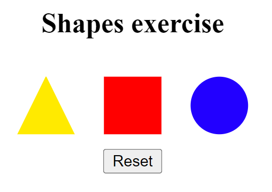
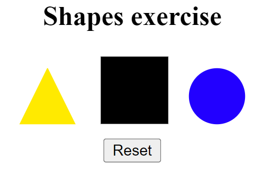
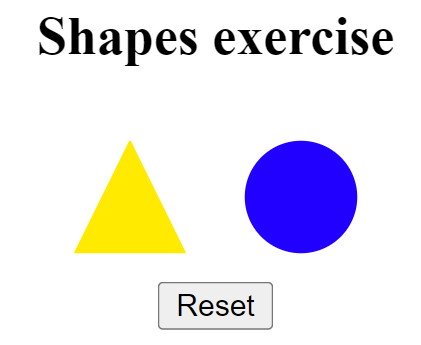

# Shapes Exercise

You can click on the shapes to hide them, also there is an animation that changes position, size and colour of the shape when you hover it with the mouse (only on devices with a mouse, it won't work on a tactile device to avoid UX problems). When you click on the reset button below, the shapes will be visible again. 

#### Result

## languages used:
### HTML
### CSS
### JAVASCRIPT
